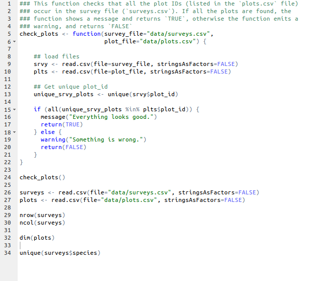

## R Script



## Current value of weight?
```{r}
weight_kg <- 57.5
(weight_lb <- 2.2 * weight_kg)
```

and then change `weight_kg` to 100.

```{r, purl=FALSE}
weight_kg <- 100
```


What do you think is the current content of the object `weight_lb`?

* 126.5 
* 200

## Weight_lb is:

```{r}
(weight_lb)
```

## Challenge 1

What are the values after each statement in the following?

```{r, purl=FALSE}
mass <- 47.5            # mass?
age  <- 122             # age?
mass <- mass * 2.0      # mass?
age  <- age - 20        # age?
mass_index <- mass/age  # mass_index?
```

## Challenge 2

Based on the output of str(surveys), can you answer the following questions?

1. What is the class of the object surveys?
2. How many rows and how many columns are in this object?
3. How many species have been recorded during these surveys?
4. As you can see, the columns species and sex are of a special class called factor. 


